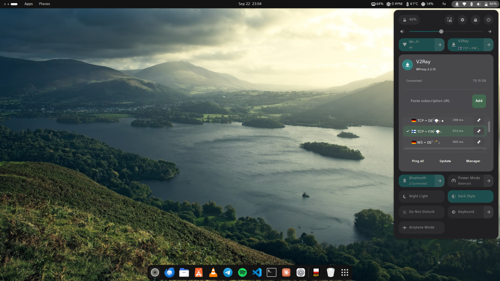
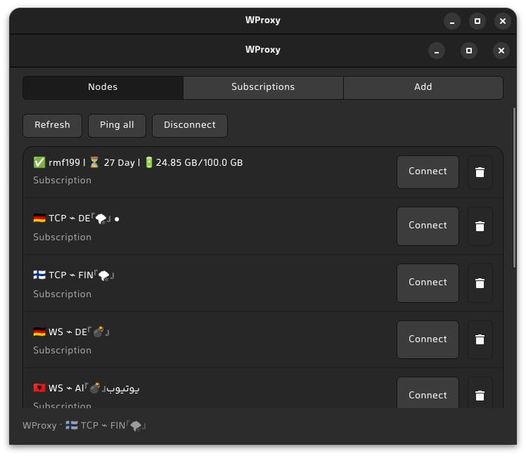

<p align="center">
  
</p>

<h1 align="center">WProxy</h1>

<p align="center" dir="rtl">
  کلاینت دسکتاپ Xray/V2Ray برای لینوکس و ویندوز<br>
  تنظیمات سریع GNOME · ویجت KDE Plasma 6 · آیکن کنار ساعت ویندوز · مسیریابی تفکیکی · خط فرمان
</p>

<p align="center">
  <a href="https://github.com/Aliazadi-1776/WProxy-v2ray/releases/latest"></a>
  <a href="https://github.com/Aliazadi-1776/WProxy-v2ray/actions/workflows/ci.yml"></a>
  <a href="https://github.com/Aliazadi-1776/WProxy-v2ray/actions/workflows/windows-release.yml"></a>
  <a href="LICENSE"></a>
</p>

<p align="center" dir="rtl">
  <a href="https://github.com/Aliazadi-1776/WProxy-v2ray/releases/tag/v2.5.0"><strong>دانلود نسخهٔ 2.5.0</strong></a>
  · <a href="README.md">English</a>
  · <a href="docs/ROUTING.md">مسیریابی</a>
  · <a href="docs/WINDOWS.md">ویندوز</a>
  · <a href="docs/KDE.md">راهنمای KDE</a>
  · <a href="docs/TESTING.md">تست‌ها</a>
  · <a href="CHANGELOG.md">تغییرات</a>
</p>

نسخهٔ **2.5.0** نصب‌کنندهٔ آمادهٔ ویندوز، بررسی واقعی آداپتور/Route/HTTPS قبل از اعلام اتصال، پنجرهٔ انتخاب برنامه برای Routing و جداسازی کامل کانفیگ‌های هر Subscription را اضافه می‌کند. اگر دو ساب لینک یکسان داشته باشند، دیگر ساب دوم روی اولی نمی‌افتد و حذف یا آپدیت یکی، سرورهای دیگری را پاک نمی‌کند.

## دریافت WProxy

| Windows 10/11 x64 | GNOME 45–51 | KDE Plasma 6 |
| --- | --- | --- |
| فایل **`WProxy-2.5.0-Setup.exe`** را از [آخرین Release](https://github.com/Aliazadi-1776/WProxy-v2ray/releases/latest) دانلود کن. | وابستگی‌های توزیع را طبق ادامهٔ راهنما نصب کن و سپس `bash scripts/install.sh --desktop gnome` را بزن. | وابستگی‌های توزیع و Plasma را نصب کن و سپس `bash scripts/install.sh --desktop kde` را بزن. |

نصب‌کنندهٔ ویندوز WProxy، Xray و Wintun را همراه خود دارد. نسخهٔ لینوکس از NetworkManager و TUN سیستم استفاده می‌کند. پیش از نصب روی سیستم جدید، [جدول پشتیبانی](#چه-سیستمهایی-پشتیبانی-میشوند) را بخوان.

> [!IMPORTANT]
> تغییر فایل ZIP به‌تنهایی نسخهٔ نصب‌شده را عوض نمی‌کند؛ باید دستور نصب همین نسخه را اجرا کنی. [شرح اصلاح و تست‌های قبل/بعد](docs/CONNECTION-FIX-2.3.1.md)

## تصاویر

### کنترل اتصال کنار وای‌فای در GNOME



### مدیر سرورها و ساب‌ها



این عکس‌های ارسالی از رابط GNOME/GTK نسخهٔ 2.2.10 هستند؛ تصویر رابط جدید KDE محسوب نمی‌شوند.

## قابلیت‌ها

- واردکردن لینک‌های VLESS، VMess، Trojan و Shadowsocks و ساب HTTP/HTTPS.
- اتصال از طریق Xray و NetworkManager با رابط TUN.
- نمایش سه سرور و اسکرول بقیه؛ دکمه‌های افزودن، پینگ و آپدیت بیرون فهرست می‌مانند.
- گنوم: کاشی V2Ray کنار Wi-Fi؛ مخفی‌کردن ورودی‌های تکراری WProxy در فهرست VPN پنل.
- KDE Plasma 6: ویجت پنل/System Tray با انتخاب سرور، قطع/وصل، پینگ، افزودن و آپدیت ساب و بازکردن Manager.
- نمایش ترافیک باقی‌مانده در صورت ارائهٔ اطلاعات مصرف توسط سرویس‌دهنده.
- سه حالت مسیریابی: همهٔ ترافیک با VPN، عبور مستقیم موارد لیست، یا فقط عبور موارد لیست از VPN.
- فایل Setup.exe ویندوز ۱۰/۱۱ بدون نیاز به نصب جداگانهٔ Python، همراه با آیکن کنار ساعت، شمارش سرورهای هر ساب، پنجرهٔ انتخاب برنامه، پینگ و اتصال تأییدشدهٔ TUN.

**پینگ، زمان اتصال TCP به سرور است؛ سالم‌بودن کامل VPN را ثابت نمی‌کند.**

## چه سیستم‌هایی پشتیبانی می‌شوند؟

موتور اصلی و تست‌شده‌تر WProxy مخصوص لینوکس است و به systemd، NetworkManager و TUN نیاز دارد. نسخهٔ 2.5.0 برای Windows x64 هم نصب‌کننده دارد و از TUN داخلی Xray استفاده می‌کند؛ فرمت ذخیره و قوانین مسیریابی مشترک‌اند ولی یکپارچه‌سازی سیستم‌عامل جداست.

| محیط | وضعیت |
| --- | --- |
| GNOME | افزونه برای **۴۵ تا ۵۱** تعریف شده؛ تست اجرا و چیدمان روی **51.beta** انجام شده، نه تک‌تک نسخه‌ها |
| KDE | ویجت مخصوص **Plasma 6**؛ تست‌های Qt/Plasma و نصب آزمایشی KPackage موفق بوده، اما تست کامل اتصال در یک نشست واقعی KDE هنوز انجام نشده |
| موتور اتصال | Linux + NetworkManager + Xray دارای TUN + Python 3 + iproute2 |
| مدیر گرافیکی | GTK4 و PyGObject؛ حتی روی KDE یا با `--desktop none` وابستگی‌های GTK لازم‌اند |
| Ubuntu / Debian و مشتقات | نصب‌کننده قابلیت نصب وابستگی با APT دارد؛ تست واقعی میزبان روی Ubuntu **26.10 development** و x86_64 بوده، نه همهٔ نسخه‌ها |
| Arch / EndeavourOS / Manjaro | دستور نصب وابستگی در پایین؛ نصب و اتصال واقعی روی این توزیع‌ها هنوز تأیید نشده |
| Fedora Workstation / KDE | راهنمای نصب با DNF؛ تست کامل نصب، SELinux و اتصال هنوز انجام نشده |
| openSUSE Tumbleweed | راهنمای آزمایشی نصب با Zypper؛ تست کامل نصب، سیاست امنیتی و اتصال هنوز انجام نشده |
| Cinnamon / Xfce / MATE / COSMIC | افزونهٔ پنل اختصاصی ندارند؛ برای موتور اتصال و GTK Manager از `--desktop none` استفاده کن؛ تست اختصاصی این دسکتاپ‌ها انجام نشده |
| Plasma 5 و GNOME خارج از ۴۵ تا ۵۱ | رابط پنل این نسخه پشتیبانی نمی‌شود |
| Windows 10/11 x64 | Setup.exe کاربرمحور در GitHub Actions ساخته می‌شود و موتور مستقل WProxy و Xray رسمی 26.9.30 را دارد؛ فقط وصل/قطع TUN مجوز Administrator می‌خواهد. ساخت و تست‌های منطقی ویندوز خودکارند، اما تست نهایی TUN روی سخت‌افزار واقعی Windows 10/11 هنوز لازم است؛ کاشی سفارشی Win+A ندارد |
| macOS / BSD | رابط و نصب‌کننده ندارند و پشتیبانی نمی‌شوند |
| NixOS / Alpine / سیستم‌های immutable | نصب‌کنندهٔ مناسب Nix، OpenRC، rpm-ostree یا transactional در این بسته وجود ندارد |
| ARM و معماری‌های دیگر | احتمال ساخت از سورس با Xray مناسب وجود دارد، اما تست نشده‌اند؛ این فایل باینری آماده برای همهٔ معماری‌ها نیست |

ویجت KDE مستقل است: آن را کنار Networks می‌گذاری؛ داخل منوی اصلی Networks دست‌کاری نمی‌کند، لیست VPN آن را مخفی نمی‌کند و ویرایشگر Qt برای آن نمی‌سازد.

ویندوز API عمومی برای افزودن کنترل دلخواه داخل Win+A Quick Settings ندارد. بنابراین WProxy از آیکن استاندارد Notification Area و پنجرهٔ کناری خودش استفاده می‌کند. کاشی VPN خود ویندوز به VPN Provider تأییدشده نیاز دارد و نمی‌تواند فهرست ساب و سرور اختصاصی WProxy را نمایش دهد. [محدودیت‌ها و نصب ویندوز](docs/WINDOWS.md)

## نصب، قدم‌به‌قدم

### ۱. وارد پوشهٔ سورس شو

ZIP را استخراج کن و ترمینال را در پوشه‌ای باز کن که `Makefile` و `scripts/` داخل آن است. برای آرشیو این نسخه:

```bash
cd WProxy-2.5.0
```

اگر از Download ZIP گیت‌هاب گرفته‌ای، نام پوشه ممکن است متفاوت باشد؛ وارد همان پوشهٔ استخراج‌شده شو. دستورها را از **حساب معمولی دسکتاپ** اجرا کن، نه ورود مستقیم با root. از محیط virtualenv/Conda خارج شو. اینترنت و دسترسی مجاز به sudo لازم است.

دسکتاپ باید از قبل نصب باشد؛ فقط دستور مربوط به دسکتاپ خودت را بزن:

برای گنوم:

```bash
gnome-shell --version
```

برای KDE:

```bash
plasmashell --version
```

گنوم باید ۴۵ تا ۵۱ و Plasma باید ۶ باشد. اسم توزیع به‌تنهایی کافی نیست. برای اجرای این راهنما لازم نیست دسکتاپ دوم نصب کنی.

### ۲. وابستگی‌های توزیع خودت را نصب کن

فقط **بخش توزیع خودت** را اجرا کن. وابستگی‌های عمومی حتی برای KDE هم لازم‌اند، چون نصب‌کننده مدیر GTK و هر دو ویرایشگر GTK را می‌سازد. دستور «فقط KDE» علاوه بر وابستگی‌های عمومی است. این مرحله هنوز خود WProxy را نصب نمی‌کند.

#### Debian / Ubuntu / Kubuntu / Linux Mint

برای نسخه‌های تحت پشتیبانی این خانواده که بسته‌های زیر در مخزنشان موجود است:

```bash
sudo apt-get update
sudo apt-get install -y \
  build-essential pkg-config libglib2.0-dev libgtk-3-dev libgtk-4-dev libnm-dev \
  network-manager python3 python3-gi gir1.2-gtk-4.0 \
  curl ca-certificates unzip iproute2 procps util-linux sudo pkexec
```

**فقط اگر Plasma 6 داری**، این‌ها را هم نصب کن:

```bash
sudo apt-get install -y \
  kpackagetool6 qml6-module-org-kde-kirigami \
  qml6-module-org-kde-plasma-plasma5support polkit-kde-agent-1
```

اگر بسته‌های Plasma 6 پیدا نشدند، بسته‌های Plasma 5 را جایگزین نکن و مخزن نسخه‌های مختلف توزیع را با هم مخلوط نکن؛ از `--desktop none` یا نسخه‌ای با Plasma 6 استفاده کن. دسکتاپ پیش‌فرض Cinnamon در Mint گنوم نیست؛ آنجا `--desktop none` مناسب است، مگر خودت دسکتاپ پشتیبانی‌شده‌ای نصب کرده باشی. در Ubuntu، در صورت پیدا نشدن بسته، فعال‌بودن مخازن رسمی همان نسخه، از جمله Universe در صورت نیاز، را بررسی کن.

#### Arch Linux / EndeavourOS / Manjaro

```bash
sudo pacman -Syu --needed \
  base-devel pkgconf glib2 glib2-devel gtk3 gtk4 libnm networkmanager \
  python python-gobject curl ca-certificates unzip iproute2 \
  procps-ng util-linux sudo polkit
```

این دستور به‌روزرسانی سیستم هم انجام می‌دهد؛ قبل از تأیید، فهرست تغییرات pacman را بخوان. آپدیت ناقص انجام نده. در مشتقات آرچ از مخازن و راهنمای به‌روزرسانی همان توزیع استفاده کن.

**فقط Plasma 6:**

```bash
sudo pacman -S --needed kpackage kirigami plasma5support polkit-kde-agent
```

نام بسته‌ها را می‌توان در [بستهٔ رسمی توسعهٔ GLib](https://archlinux.org/packages/core/x86_64/glib2-devel/)، [فهرست فایل‌های KPackage](https://archlinux.org/packages/extra/x86_64/kpackage/files/) و [راهنمای رسمی PyGObject](https://pygobject.gnome.org/getting_started.html) بررسی کرد.

#### Fedora Workstation / Fedora KDE؛ نصب معمولی مبتنی بر DNF

```bash
sudo dnf install \
  gcc make pkgconf-pkg-config glib2-devel gtk3-devel gtk4-devel \
  NetworkManager NetworkManager-libnm-devel python3 python3-gobject gtk4 \
  curl ca-certificates unzip iproute procps-ng util-linux sudo polkit
```

**فقط Plasma 6:**

```bash
sudo dnf install kf6-kpackage kf6-kirigami plasma5support polkit-kde
```

مراجع بسته‌ها: [توسعهٔ NetworkManager](https://packages.fedoraproject.org/pkgs/NetworkManager/NetworkManager-libnm-devel/)، [KPackage](https://packages.fedoraproject.org/pkgs/kf6-kpackage/kf6-kpackage/)، [Plasma5Support](https://packages.fedoraproject.org/pkgs/plasma5support/plasma5support/). این دستورها برای Silverblue، Kinoite، سایر نسخه‌های Atomic، RHEL و CentOS نیستند. SELinux را برای راه‌اندازی برنامه خاموش نکن؛ خطاهای سیاست امنیتی باید جداگانه بررسی شوند.

#### openSUSE Tumbleweed؛ نصب معمولی

```bash
sudo zypper refresh
sudo zypper install \
  gcc make pkg-config glib2-devel gtk3-devel gtk4-devel 'pkgconfig(libnm)' \
  NetworkManager python3 python3-gobject python3-gobject-Gdk typelib-1_0-Gtk-4_0 \
  curl ca-certificates unzip iproute2 procps util-linux sudo polkit
```

عبارت `pkgconfig(libnm)` از مدیر بسته می‌خواهد بستهٔ فراهم‌کنندهٔ فایل‌های توسعهٔ libnm را نصب کند.

**فقط Plasma 6:**

```bash
sudo zypper install kf6-kpackage kf6-kirigami-imports plasma5support6 polkit-kde-agent-6
```

مراجع: [راهنمای رسمی PyGObject برای openSUSE](https://pygobject.gnome.org/getting_started.html#opensuse) و [بستهٔ Plasma5Support در openSUSE](https://build.opensuse.org/package/show/openSUSE:Factory/plasma5support6). این **راهنمای آزمایشی Tumbleweed** است، نه تضمین همهٔ نسخه‌های Leap/SUSE. اگر بسته‌ای در مخازن رسمی فعال تو پیدا نشد، اول تفاوت نام/نسخه را حل کن؛ مخزن شخص ثالث تصادفی اضافه نکن. نصب‌های MicroOS/Aeon/Kalpa و transactional پوشش داده نشده‌اند.

### ۳. پیش‌نیازها را بررسی کن؛ بعد خود WProxy را نصب کن

در پوشهٔ سورس، این بررسی‌ها باید موفق باشند:

```bash
make check-deps
python3 -c "import gi; gi.require_version('Gtk', '4.0'); from gi.repository import Gtk; print('GTK4 / PyGObject: OK')"
command -v pkexec
nmcli general status
systemctl is-active NetworkManager
```

NetworkManager باید از قبل اتصال اینترنت را مدیریت کند. اگر از مدیر شبکهٔ دیگری استفاده می‌کنی، اول طبق راهنمای توزیع مهاجرت کن؛ فعال‌کردن هم‌زمان دو مدیر شبکه ممکن است اینترنت را قطع کند. فقط اگر سیستم از قبل برای NetworkManager تنظیم شده و سرویس صرفاً متوقف است، از `sudo systemctl enable --now NetworkManager` استفاده کن.

در KDE دستور `kpackagetool6 --version` را هم بررسی کن و مطمئن شو عامل احراز هویت Polkit دسکتاپ فعال است.

**در آخر دقیقاً یکی از دستورهای زیر را بزن:**

گنوم ۴۵ تا ۵۱:

```bash
bash scripts/install.sh --desktop gnome
```

KDE Plasma 6:

```bash
bash scripts/install.sh --desktop kde
```

فقط موتور اتصال و مدیر GTK، بدون رابط پنل:

```bash
bash scripts/install.sh --desktop none
```

دستور `bash scripts/install.sh` هم داخل نشست گنوم/Plasma دسکتاپ را خودکار تشخیص می‌دهد؛ انتخاب صریح بالا برای مشتقات کم‌ابهام‌تر است.

نصب‌کننده برنامه را از سورس می‌سازد و برای فایل‌های سیستمی sudo می‌خواهد. **نصب خودکار وابستگی ناقص فقط با APT پیاده شده**؛ روی Arch/Fedora/openSUSE اول مرحلهٔ ۲ را کامل کن. اگر Xray وجود نداشته باشد، [نصب‌کنندهٔ رسمی XTLS](https://github.com/XTLS/Xray-install) دانلود و با دسترسی root اجرا می‌شود؛ قبل از اجرا این اسکریپت را بررسی کن. Xray موجود خودکار ارتقا پیدا نمی‌کند و باید native TUN داشته باشد؛ نسخهٔ تست‌شده **26.3.27** بوده، نه همهٔ نسخه‌های قدیمی یا جدید.

از فایل‌های جایگزین‌شده در `/var/backups/` بکاپ گرفته می‌شود. اتصال WProxy هنگام ارتقا موقتاً متوقف می‌شود، ولی کل NetworkManager ری‌استارت نمی‌شود. این بسته نصب‌کنندهٔ سورس است، نه DEB/RPM/Flatpak تحت مدیریت توزیع.

### ۴. رابط پنل را فعال کن

**گنوم:** یک بار Log out / Log in کن. اگر کاشی فعال نبود، `gnome-extensions enable wproxy@wrench.local` را بزن. برای ویرایشگر VPN، پنجرهٔ GNOME Settings را ببند و دوباره باز کن.

**KDE:** از **Configure System Tray → Entries → WProxy → Always shown** نمایش دائمی را فعال کن؛ یا از **Edit panel → Add Widgets → WProxy** ویجت را اضافه کن و کنار Networks بکش. برای نسخهٔ کش‌شدهٔ قبلی، ویجت را حذف/اضافه کن یا یک بار از نشست خارج و وارد شو. [راهنمای KDE](docs/KDE.md)

با `wproxyctl --version` نصب را بررسی کن، سپس `wproxy-manager` را باز کن و ساب یا سرور خودت را اضافه کن. هیچ سرور واقعی یا مشخصات اتصال داخل بسته نیست؛ نصب موفق به‌تنهایی به معنی اتصال موفق VPN نیست.

### نصب روی Windows 10/11

فایل `WProxy-2.5.0-Setup.exe` و فایل `.sha256` کنارش را از [Release نسخهٔ 2.5.0](https://github.com/Aliazadi-1776/WProxy-v2ray/releases/tag/v2.5.0) بگیر، هش را بررسی و Setup را اجرا کن. Python و دانلود جداگانهٔ Xray لازم نیست. برنامه بعد از نصب باز می‌شود و فقط هنگام وصل/قطع TUN پنجرهٔ Administrator نشان می‌دهد.

داخل نصب‌کننده نسخهٔ رسمی Xray **26.9.30** و Wintun قرار می‌گیرد؛ GitHub Actions هش SHA-256 آرشیو بالادستی را قبل از ساخت کنترل می‌کند. جزئیات استفاده، Routing و محدودیت تست فعلی در [راهنمای ویندوز](docs/WINDOWS.md) آمده است.

### به‌روزرسانی نسخهٔ نصب‌شدهٔ گنوم و تست اتصال

```bash
bash scripts/apply-fix.sh --test
```

ابتدا سرورها با HTTPS آزمایش می‌شوند؛ سپس اتصال NetworkManager، مسیر TUN و HTTPS از داخل تونل بررسی می‌شود. اتصال موفق روشن می‌ماند و شکست تست مسیر/HTTPS باعث قطع WProxy می‌شود. `verification.txt` فایل محلی است؛ آن را همراه اطلاعات ساب در گیت‌هاب نگذار.

## استفاده

```bash
wproxy-manager
wproxyctl sub add 'https://example.com/subscription'
wproxyctl sub update
sudo wproxyctl nm sync
wproxyctl node list
wproxyctl node ping --all
wproxyctl nm up NODE_ID
wproxyctl nm down

# وایت‌لیست: این دستورها را تب Routing در برنامه هم انجام می‌دهد
wproxyctl routing mode bypass
wproxyctl routing domain add youtube.com
wproxyctl routing app add firefox
sudo wproxyctl nm sync
```

برای افزودن/آپدیت ساب از پنل ممکن است پنجرهٔ احراز هویت Polkit باز شود؛ این مجوز برای همگام‌سازی پروفایل‌های NetworkManager است.

حذف Node یا Subscription از **WProxy Manager** حالا خود NetworkManager را نیز sync می‌کند؛ یعنی Connectionهای لودشدهٔ WProxy از **Settings → VPN** هم پاک می‌شوند و فقط `store.json` تغییر نمی‌کند. پنجرهٔ Polkit را تأیید کن و اگر Settings باز بوده، آن را ببند و دوباره باز کن. در CLI بعد از `node remove` یا `sub remove` باید `sudo wproxyctl nm sync` را اجرا کنی. حذف فقط پروفایل‌هایی را هدف می‌گیرد که service marker و UUID قطعی WProxy همان کاربر را دارند و به VPNهای دیگر دست نمی‌زند.

تغییر قانون روی اتصال بعدی اعمال می‌شود. مدیر گرافیکی قانون را ذخیره و پروفایل‌ها را خودکار sync می‌کند؛ بعد از تغییر با CLI باید `sudo wproxyctl nm sync` را اجرا کنی. [رفتار دقیق و نکات حریم خصوصی](docs/ROUTING.md)

## تست و حذف

برای `make test` علاوه بر وابستگی‌های نصب، Node.js توزیع را لازم داری. تست‌های رابط KDE/GNOME ابزارهای اضافهٔ خودشان را می‌خواهند؛ [جزئیات تست‌ها](docs/TESTING.md) را ببین.

```bash
make all
make test
bash scripts/test-kde.sh

# فقط ویجت KDE، بدون sudo
bash scripts/uninstall-kde-widget.sh

# فایل‌های برنامه و پروفایل‌های ساخته‌شده توسط آن
bash scripts/uninstall.sh
```

حذف برنامه، فایل ساب‌ها در `~/.config/wproxy/` و خود Xray را نگه می‌دارد. ویجت KDE را جداگانه حذف کن. [جزئیات تست‌ها و محدودیت‌ها](docs/TESTING.md)

## انتشار در گیت‌هاب

محتویات همین پوشه را در ریشهٔ مخزن قرار بده، نه خود فایل ZIP را. سورس، READMEها، تصاویر و تنظیمات CI آماده‌اند. اطلاعات ساب، کانفیگ‌های شخصی، لاگ و خروجی‌های کامپایل نباید به مخزن اضافه شوند؛ `.gitignore` برای آن‌ها وجود دارد.

فایل‌های `~/.config/wproxy/` در لینوکس و `%APPDATA%\WProxy` در ویندوز خصوصی‌اند. حالت bypass یا only عمداً بخشی از ترافیک را بیرون VPN می‌فرستد؛ حالت پیش‌فرض همچنان عبور همهٔ ترافیک از VPN است.

## مجوز

سورس WProxy با مجوز [MIT](LICENSE) منتشر می‌شود. Xray، Wintun، NetworkManager، GNOME، KDE و Qt پروژه‌های جداگانه با مجوزهای خودشان هستند. باینری تولیدشده داخل آرشیو سورس commit نمی‌شود؛ نصب‌کنندهٔ Release ویندوز فایل‌های رسمی و تأییدشدهٔ Xray/Wintun را همراه متن مجوزشان بسته‌بندی می‌کند.
